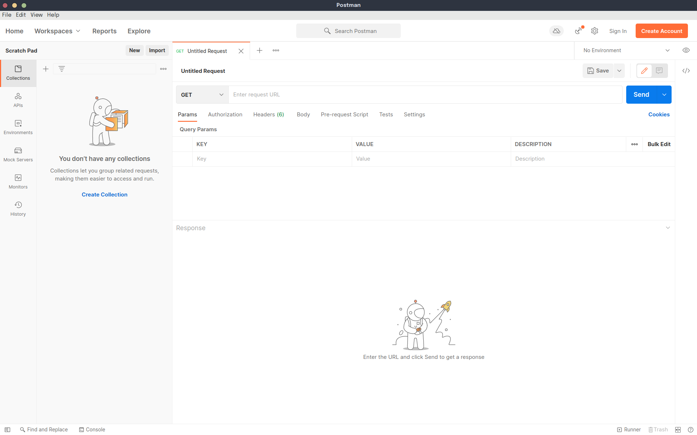
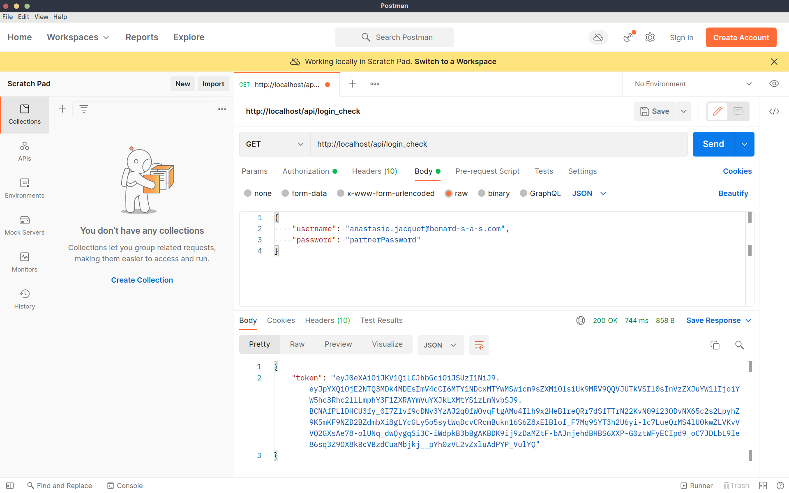
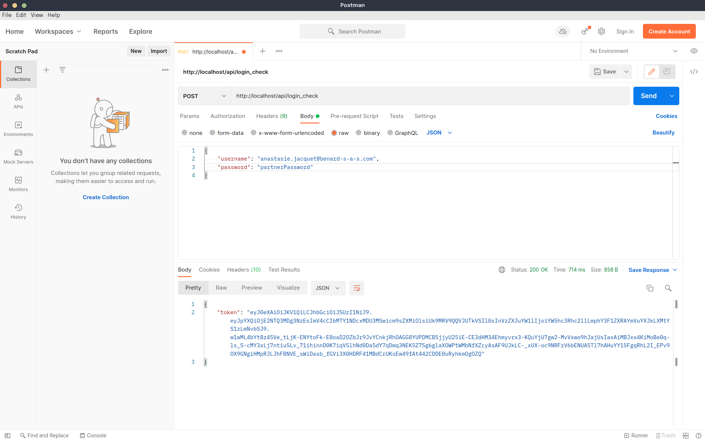
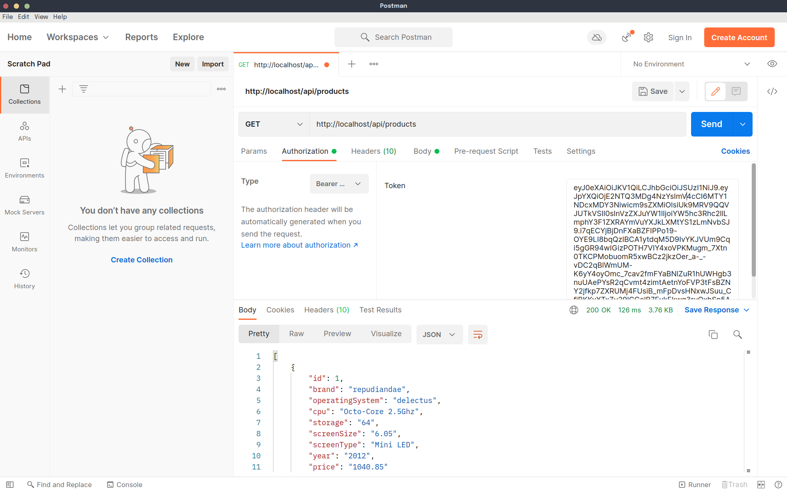

# API BileMo

**Version de l'API :** `1.0-20220607`

En cas de doute vis à vis des termes, référez vous au [glossaire](glossary.md).

---
## Authentification
Pour accéder à l'API nue, il est nécessaire d'utiliser un token JWT pour toute action souhaitée. Il existe plusieurs manières d'obtenir le token en question.

### Terminal

À travers le terminal, utilisez cette commande, elle vous donnera en réponse le token à condition que les credentials sont corrects.
```sh
curl -X POST -H "Content-Type: application/json" https://localhost/api/login_check -d '{"username":"johndoe","password":"test"}'
```

**IMPORTANT !**
Il est important de noter, au cas où vous travaillez dans un environnement où une personne tierce peut accéder à votre machine, d'entrer un espace avant d'effectuer la commande dans votre terminal. Ainsi, la personne tentant de prendre contrôle de votre appareil ne pourra pas accéder à la commande à travers l'historique en cas de nouvelle session de terminal.

### Client API 
Ceci est valable pour *[Postman](https://www.postman.com/)*, *[Thunder dans Visual Studio Code](https://marketplace.visualstudio.com/items?itemName=rangav.vscode-thunder-client)*, etc.

Lorsque vous vous voudrez utiliser le token pour faire vos requêtes, avec Postman, vous allez avoir 4 étapes

0. Interface de Postman sans intervention utilisateur


1.Entrez vos informations de mot de passe dans le chemin `/login_check` dans le corps en raw JSON




---
## Produits
### Consulter la liste des produits BileMo
#### Route
```
/api/products
```

#### Méthode
```
- GET
```

#### Réponse

**HTTP OK (200)** : La requête s'est déroulée correctement.

```json
[
    {
        "id": number,
        "brand": "string",
        "operatingSystem": "string",
        "cpu": "string",
        "storage": "string",
        "screenSize": "string",
        "screenType": "string",
        "year": "string",
        "price": float
    },
    {
        "id": number,
        "brand": "string",
        "operatingSystem": "string",
        "cpu": "string",
        "storage": "string",
        "screenSize": "string",
        "screenType": "string",
        "year": "string",
        "price": float
    },
    // ...
]
```

#### Erreurs possibles
**HTTP BAD REQUEST (400)**: Quelque chose dans votre requête ne fonctionne pas. Vérifier le lien ou toute faute de frappe éventuelle.


---

### Consulter le détail d'un produit BileMo
#### Route
```
/api/products/{id}
```

#### Méthode
```
- GET
```

#### Réponse

**HTTP OK (200)** : La requête s'est déroulée correctement.

```json
{
    "id": number,
    "brand": "string",
    "operatingSystem": "string",
    "cpu": "string",
    "storage": "string",
    "screenSize": "string",
    "screenType": "string",
    "year": "string",
    "price": float
}
```

#### Erreurs possibles
**HTTP BAD REQUEST (400)** : Quelque chose dans votre requête ne fonctionne pas. Vérifier le lien ou toute faute de frappe éventuelle.

**HTTP UNAUTHORIZED (401)** : Vous ne disposez pas d'accès à l'API. Vérifiez si vous êtes connecté•e avant de réessayer votre requête.

**HTTP FORBIDDEN (403)** : Vous n'avez pas l'autorisation de procéder à cette requête. Vous n'en disposez pas les droits.

**HTTP NOT FOUND (404)** : Le produit spécifié dans l'IRI n'est pas correct. Peut-être avez-vous fait une erreur ou qu'il a été supprimé.

---

## Clients
### Afficher tous les clients liés à un partenaire sur le site web

Cette requête affiche tous les clients d'un partenaire. Ce chemin peut être vu uniquement par partenaires qui veulent voir leur clientèle. Cela peut ainsi servir à obtenir les fiches de ses clients.

#### Route
```
/api/partners/{partnerId}/customers
```

#### Méthode
```
- GET
```

#### Réponse

**HTTP OK (200)** : La requête s'est déroulée correctement.

```json
{
    "id": number,
    "name": "string",
    "email": "string",
    "postalAddress": "string",
    "phoneNumber": "string",
    "vatNumber": "string",
    "siret": "string",
    "customers": [
        {
            "id": number,
            "name": "string",
            "email": "string",
            "postalAddress": "string",
            "phoneNumber": "string"
        },
        {
            "id": number,
            "name": "string",
            "email": "string",
            "postalAddress": "string",
            "phoneNumber": "string"
        },
        {
            "id": number,
            "name": "string",
            "email": "string",
            "postalAddress": "string",
            "phoneNumber": "string"
        },
        // ... pour autant de clients présents dans la base de données
    ]
}
```

#### Erreurs possibles
**HTTP BAD REQUEST (400)** : Quelque chose dans votre requête ne fonctionne pas. Vérifier le lien ou toute faute de frappe éventuelle.

**HTTP UNAUTHORIZED (401)** : Vous ne disposez pas d'accès à l'API. Vérifiez si vous êtes connecté•e avant de réessayer votre requête.

**HTTP FORBIDDEN (403)** : Vous n'avez pas l'autorisation de procéder à cette requête. Vous n'en disposez pas les droits.

**HTTP NOT FOUND (404)** : Le produit spécifié dans l'IRI n'est pas correct. Peut-être avez-vous fait une erreur ou qu'il a été supprimé.


---

### Afficher un client lié à un partenaire

Lorsque vous faites une requête pour voir le détail d'un client, vous allez aussi obtenir le partenaire auquel il est lié.

#### Route
```
/api/{partnerId}/customers/{customerId}
```

#### Méthode
```
- GET
```

#### Réponse

**HTTP OK (200)** : La requête s'est déroulée correctement.

```json
{
    "id": number,
    "name": "string",
    "email": "string",
    "postalAddress": "string",
    "phoneNumber": "string",
    "reseller": {
        "email": "string",
        "postalAddress": "string",
        "phoneNumber": "string",
        "vatNumber": "string",
        "siret": "string"
    }
}
```

#### Erreurs possibles
**HTTP BAD REQUEST (400)** : Quelque chose dans votre requête ne fonctionne pas. Vérifier le lien ou toute faute de frappe éventuelle.

**HTTP UNAUTHORIZED (401)** : Vous ne disposez pas d'accès à l'API. Vérifiez si vous êtes connecté•e avant de réessayer votre requête.

**HTTP FORBIDDEN (403)** : Vous n'avez pas l'autorisation de procéder à cette requête. Vous n'en disposez pas les droits.

**HTTP NOT FOUND (404)** : Le produit spécifié dans l'IRI n'est pas correct. Peut-être avez-vous fait une erreur ou qu'il a été supprimé.


---


### Ajouter un nouveau client
#### Route
```
/api/customers/new
```

#### Méthode
```
- POST
```

#### Réponse

**HTTP RESOURCE CREATED (201)** : La création de l'object s'est déroulée correctement.

```json
{
    "id": number,
    "name": "string",
    "email": "string",
    "password": "string",
    "postalAddress": "string",
    "phoneNumber": "string",
    "reseller": number
},
```

#### Erreurs possibles
**HTTP BAD REQUEST (400)** : Quelque chose dans votre requête ne fonctionne pas. Vérifier le lien ou toute faute de frappe éventuelle.

**HTTP UNAUTHORIZED (401)** : Vous ne disposez pas d'accès à l'API. Vérifiez si vous êtes connecté•e avant de réessayer votre requête.

**HTTP FORBIDDEN (403)** : Vous n'avez pas l'autorisation de procéder à cette requête. Vous n'en disposez pas les droits.


---

### Supprimer un client
#### Route
```
/api/partners/{partnerId}/customers/{customerId}/delete
```

#### Méthode
```
- DELETE
```

#### Réponse
**HTTP NO CONTENT (204)** : La suppression s'est déroulée correctement

#### Erreurs possibles
**HTTP BAD REQUEST (400)** : Quelque chose dans votre requête ne fonctionne pas. Vérifier le lien ou toute faute de frappe éventuelle.

**HTTP UNAUTHORIZED (401)** : Vous ne disposez pas d'accès à l'API. Vérifiez si vous êtes connecté•e avant de réessayer votre requête.

**HTTP FORBIDDEN (403)** : Vous n'avez pas l'autorisation de procéder à cette requête. Vous n'en disposez pas les droits.

**HTTP NOT FOUND (404)** : Le produit spécifié dans l'IRI n'est pas correct. Peut-être avez-vous fait une erreur ou qu'il a déjà été supprimé.

