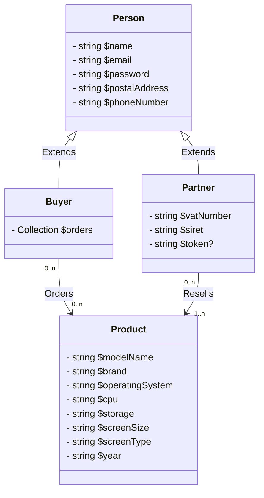

```mermaid
    classDiagram
        Person <|-- Buyer: Extends
        Person <|-- Partner: Extends
        Buyer "0..n" --> "0..n" Product: Orders
        Partner "0..n" --> "1..n" Product: Resells
        class Person {
            - string $name
            - string $email
            - string $password
            - string $postalAddress
            - string $phoneNumber
        }
        %% Those who will order the products %%
        class Buyer {
            - Collection<Product> $orders
        }
        %% As in BileMo's Commercial Partner %%
        class Partner {
            - string $vatNumber
            - string $siret
            - string $token?
        }
        %% Asserting that they will only make a phone catalog %%
        class Product {
            - string $modelName
            - string $brand
            - string $operatingSystem
            - string $cpu
            - string $storage
            - string $screenSize
            - string $screenType
            - string $year
        }
```
