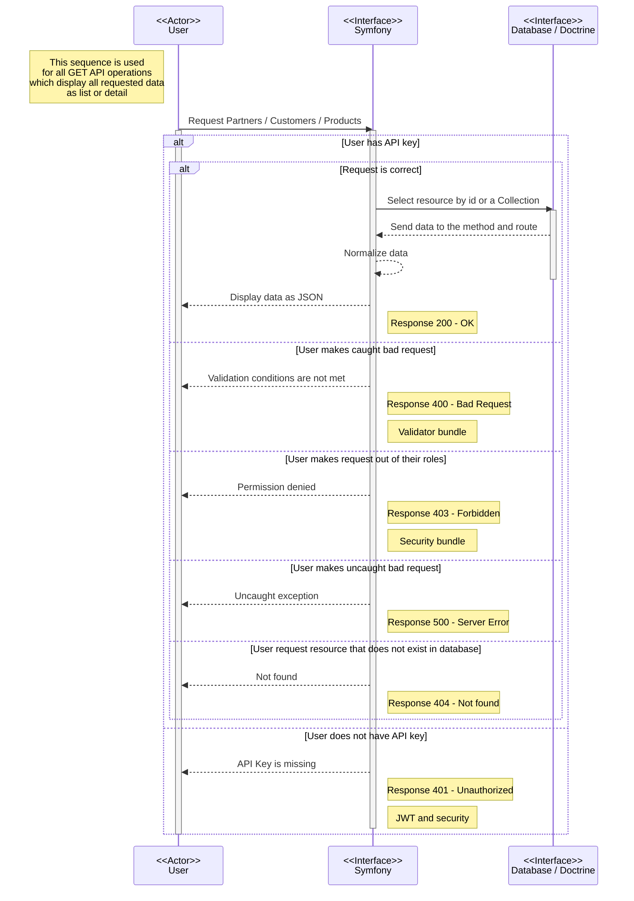

```mermaid
    sequenceDiagram
    participant U as <<Actor>><br/>User
    participant S as <<Interface>><br/>Symfony
    participant D as <<Interface>><br/>Database / Doctrine

    note left of U: This sequence is used <br/>for all GET API operations<br/>which display all requested data <br/>as list or detail
    U ->> S: Request Partners / Customers / Products
    activate U
    activate S
    alt User has API key
        alt Request is correct
            S ->> D: Select resource by id or a Collection
            activate D
            D -->> S: Send data to the method and route
            S -->> S: Normalize data
            deactivate D
            S -->> U: Display data as JSON
            note right of S: Response 200 - OK
        else User makes caught bad request
            S -->> U: Validation conditions are not met
            note right of S: Response 400 - Bad Request
            note right of S: Validator bundle
        else User makes request out of their roles
            S -->> U: Permission denied
            note right of S: Response 403 - Forbidden
            note right of S: Security bundle
        else User makes uncaught bad request
            S -->> U: Uncaught exception
            note right of S: Response 500 - Server Error
        else User request resource that does not exist in database
            S -->> U: Not found
            note right of S: Response 404 - Not found
        end
    else User does not have API key
        S -->> U: API Key is missing
        note right of S: Response 401 - Unauthorized
        note right of S: JWT and security
        deactivate S
    end
    deactivate U
```
