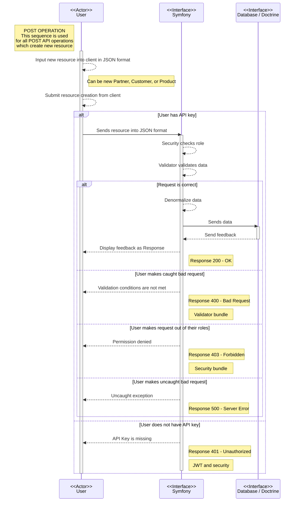

```mermaid
    sequenceDiagram
    participant U as <<Actor>><br/>User
    participant S as <<Interface>><br/>Symfony
    participant D as <<Interface>><br/>Database / Doctrine

    note left of U: POST OPERATION<br/>This sequence is used <br/>for all POST API operations<br/>which create new resource
    activate U
    U -->> U: Input new resource into client in JSON format
    note right of U: Can be new Partner, Customer, or Product
    U -->> U: Submit resource creation from client
    alt User has API key
            U ->> S: Sends resource into JSON format
            activate S
            S -->> S: Security checks role
            S -->> S: Validator validates data
        alt Request is correct
            S -->> S: Denormalize data
            S ->> D: Sends data
            activate D
            D -->> S: Send feedback
            deactivate D
            S -->> U: Display feedback as Response
            note right of S: Response 200 - OK
        else User makes caught bad request
            S -->> U: Validation conditions are not met
            note right of S: Response 400 - Bad Request
            note right of S: Validator bundle
        else User makes request out of their roles
            S -->> U: Permission denied
            note right of S: Response 403 - Forbidden
            note right of S: Security bundle
        else User makes uncaught bad request
            S -->> U: Uncaught exception
            note right of S: Response 500 - Server Error
        end
    else User does not have API key
        S -->> U: API Key is missing
        note right of S: Response 401 - Unauthorized
        note right of S: JWT and security
        deactivate S
    end
    deactivate U
```
