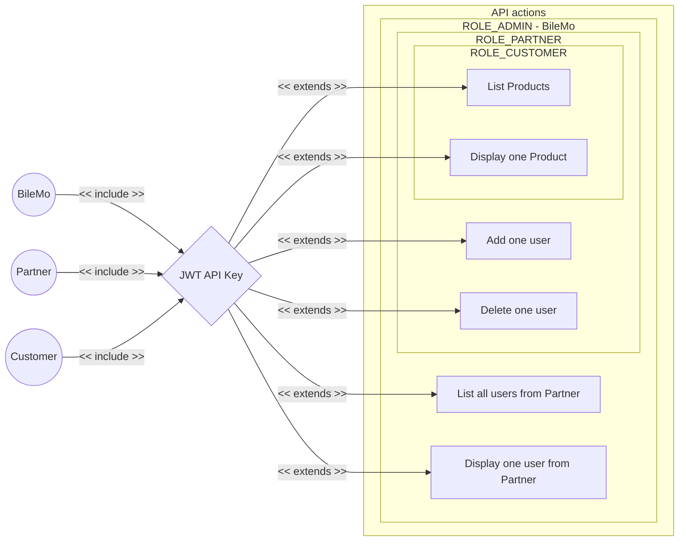

```mermaid
    flowchart LR
        BileMo((BileMo)) -->|<< include >>| JWT{JWT API Key}
        Partner((Partner)) --> |<< include >>| JWT
        Customer((Customer)) --> |<< include >>| JWT

        JWT -->|<< extends >>|Ma
        JWT -->|<< extends >>|Mb
        JWT -->|<< extends >>|MPa
        JWT -->|<< extends >>|MPb
        JWT -->|<< extends >>|CommonA
        JWT -->|<< extends >>|CommonB

        subgraph API actions
            subgraph ROLE_ADMIN - BileMo
                Ma[List all users from Partner]
                Mb[Display one user from Partner]
                subgraph ROLE_PARTNER
                    MPa[Add one user]
                    MPb[Delete one user]
                    subgraph ROLE_CUSTOMER
                        CommonA[List Products]
                        CommonB[Display one Product]
                    end
                end
            end
        end

```
